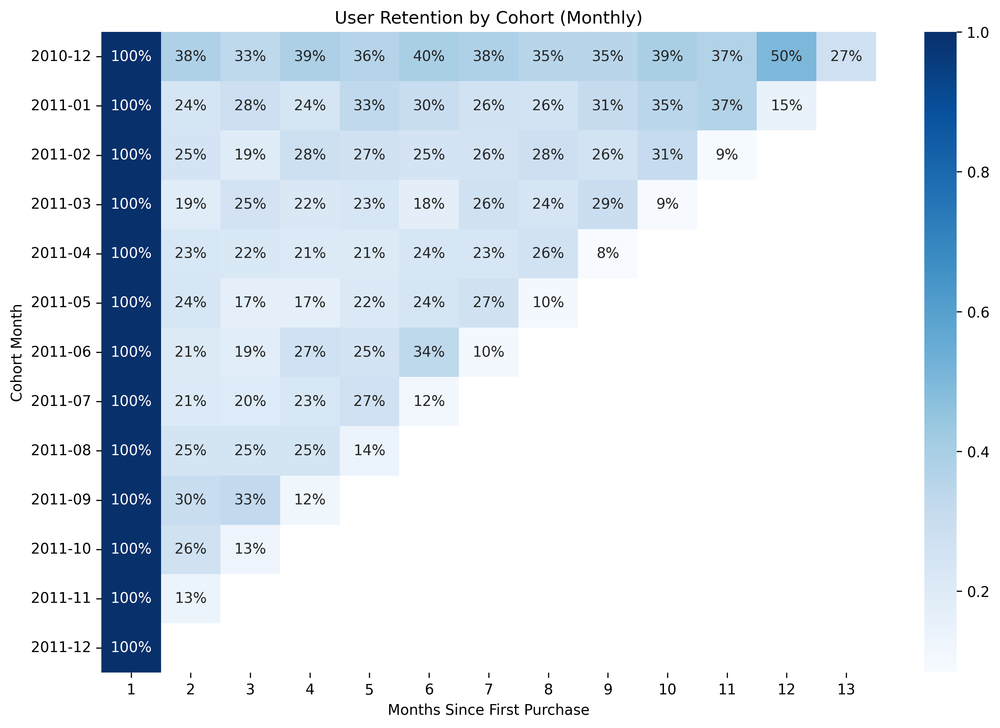

# User Behavior & Cohort Analysis

This project performs a detailed cohort retention analysis on e-commerce transaction data to uncover user retention trends and derive actionable insights.

---

## 📊 Tools & Data

- **Languages & Libraries:** Python, Pandas, Matplotlib, Seaborn  
- **Notebook:** `user_behavior_analysis.ipynb`  
- **Dataset:** Transaction data CSV (`data/data.csv`)  
- **Visuals:** `screenshots/retention_heatmap.png`

---

## 🔍 Analysis Overview

1. **Data Loading & Cleaning**  
   - Loaded transaction records with `CustomerID` and `InvoiceDate`.  
   - Cleaned column names and removed missing values.

2. **Cohort Definition**  
   - **CohortMonth:** Month of each user’s first purchase.  
   - **InvoiceMonth:** Month of each subsequent transaction.

3. **Retention Calculation**  
   - Computed the number of unique customers per cohort per month.  
   - Calculated **CohortIndex** = months since first purchase.  
   - Built a pivot table of user counts and derived retention rates (%).

4. **Visualization**  
   - Heatmap of retention rates: rows = cohorts, columns = months since first purchase.

---

## 📈 Key Findings

1. **Rapid Early Churn**  
   - Only 20–40% of new users return in Month 2.  
   - *Implication:* The first 30 days are critical—deploy welcome series and personalized offers immediately after signup.

2. **Stabilized Retention Over Time**  
   - Retention levels out around 15–30% in Months 3–6.  
   - *Implication:* Reward “survivor” users with loyalty programs or VIP perks to encourage long-term engagement.

3. **Retention Spikes Indicate Effective Campaigns**  
   - Noticeable upticks (e.g., Month 4 for Feb 2011 cohort) indicate successful promotions.  
   - *Implication:* Identify and replicate these tactics across other cohorts.

4. **Long-Term Decline for Early Cohorts**  
   - Early cohorts (e.g., Dec 2010–Mar 2011) drop below 10% by Month 8–9.  
   - *Implication:* Measure improvements by comparing with more recent cohorts.

5. **Opportunities for Re-Engagement**  
   - Bumps in retention during Months 5–8 suggest mid-term re-engagement campaigns are effective.  
   - *Implication:* Schedule targeted email reminders or feature updates around Months 4–6.

---

## 🚀 Recommendations

- **Optimize the Month 2–3 Window**  
  Automate a follow-up sequence (welcome emails, onboarding tips) to reduce churn immediately after first purchase.

- **Scale Successful Campaigns**  
  Perform detailed analysis of retention “spikes” to extract best practices and apply them to other user segments.

- **Implement Loyalty Programs**  
  Introduce point systems or subscription tiers to reward users who remain active past Month 3.

- **Segmented Engagement**  
  Tailor re-engagement strategies by acquisition channel (email, social, organic) and device type (mobile vs. desktop).

- **Mid-Term Re-Engagement**  
  Deploy targeted campaigns between Months 5–8, when users are most receptive to returning.

---

## 📂 Project Structure

